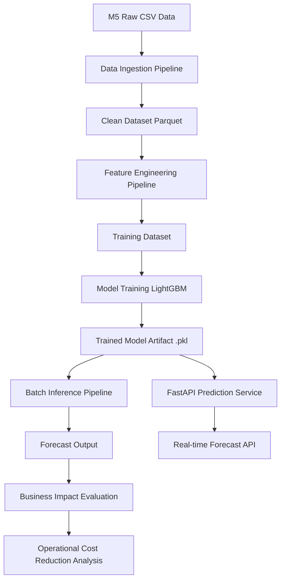
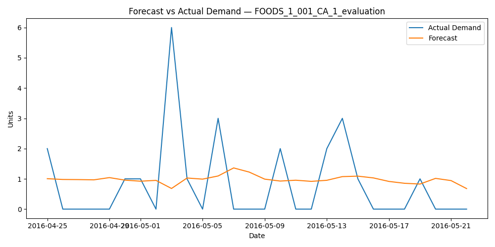

# ai-demand-forecasting-platform
End-to-end demand forecasting platform for retail supply chains (M5): pipelines, feature engineering, MLflow, and batch/real-time inference.
# AI Demand Forecasting Platform (End-to-End) — Supply Chain

An end-to-end demand forecasting platform for multi-SKU retail/CPG scenarios, designed as a production-like system: data ingestion, feature store, model training, model registry, batch + real-time inference, monitoring, and measurable business impact.


## Why this project
Forecasting is a core driver of supply chain performance (service level, inventory, working capital, and cost).
This project demonstrates:
- **Data Engineering**: robust pipelines and data quality controls
- **Data Science**: feature engineering and forecasting experimentation
- **AI/ML**: modern models (GBM, deep learning) and ensembles
- **MLOps**: reproducibility, tracking, model registry, monitoring, retraining
- **Supply Chain Impact**: metrics tied to inventory and lost sales

---

## Business problem
Given daily sales history for multiple products (SKUs), forecast demand at different horizons (e.g., 7/14/28 days) while handling:
- seasonality, holidays, promotions
- cold start (new items)
- outliers and stockouts
- multiple locations (optional extension)

### Deliverables (what the platform produces)
- Forecasts by SKU and horizon (P50 + optional prediction intervals)
- Model performance reports by SKU segment
- Monitoring dashboard (data drift + forecast error drift)
- A simple financial impact simulation (inventory vs lost sales tradeoff)

---

## Tech stack (suggested)
**Data Engineering**
- Python, Pandas/Polars
- DuckDB (local) / Postgres (optional)
- Prefect or Airflow (or simple CLI pipelines to start)

**MLOps**
- MLflow (tracking + model registry)
- DVC (optional) for data versioning

**Modeling**
- Baseline: Seasonal Naive
- Statistical: Prophet (optional)
- ML: LightGBM/XGBoost
- Deep Learning: LSTM or Temporal Fusion Transformer (optional phase)

**Serving**
- FastAPI (real-time inference endpoint)
- Batch inference job (daily)

---

## Repository structure

### Architecture Diagram



---

## Data
This project supports two options:

### Option A — Public dataset (recommended)
Use **M5 Forecasting** (Walmart sales) or similar multi-SKU datasets.

- Daily unit sales by item/store, calendar events, and prices.
- Great for multi-horizon forecasting and feature engineering.

### Option B — Synthetic generator
A synthetic data generator is included to create realistic patterns (seasonality, promotions, shocks) for quick iteration.

---

## Forecasting approach
### 1) Baseline models (must-have)
- Seasonal Naive (weekly seasonality)
- Moving Average
Goal: establish a strong baseline and sanity check.

### 2) ML models (core)
- LightGBM/XGBoost using engineered features:
  - lags (1,7,14,28)
  - rolling mean/std
  - day-of-week, month, holidays
  - promo/price features (if available)
  - stockout flags

### 3) Deep learning (stretch)
- LSTM / TFT for SKUs with complex patterns
- Compare against ML models for incremental gain

### 4) Ensemble (optional)
- Weighted blend of top models by SKU segment

---

## Evaluation
### Forecast accuracy metrics
- **WAPE** (preferred for business)
- **RMSE**
- **MAPE** (careful with zeros)
- **Bias** (systematic over/under forecasting)

### Supply-chain aligned KPIs (impact)
A lightweight simulation links forecast quality to operations:

- **Lost Sales** (proxy): `max(demand - inventory, 0)`
- **Holding Cost**: `inventory * holding_cost_rate`
- **Service Level (Fill Rate)**

Outputs:
- Cost/service curves by model
- Recommended policy sensitivity (simple reorder point approximation)

---

## Data quality & leakage controls
- Time-based split (no random split)
- Missing dates filled per SKU
- Outlier handling strategy documented
- Stockouts treated as censored demand (flag + imputation strategy)
- Leakage prevention: features built using only past data

---

## MLOps design
- MLflow experiment tracking for every run:
  - dataset version
  - features configuration
  - model hyperparameters
  - metrics by SKU and global
- Model registry stages: `Staging → Production`
- Retraining trigger examples:
  - WAPE drift above threshold
  - data drift in key features

---

## Quickstart (local)
### 1) Create environment
```bash
python -m venv .venv
source .venv/bin/activate  # Windows: .venv\Scripts\activate
pip install -r requirements.txt

1) Run the pipeline (example)
python -m pipelines.ingestion.run
python -m pipelines.preprocessing.run
python -m pipelines.feature_engineering.run
python -m pipelines.training.run --model lgbm
python -m pipelines.inference.run --mode batch

2) Start the API (optional)
uvicorn src.serving.app:app --reload

```
---
### Roadmap
Phase 1 — MVP 
  - dataset ingestion + clean time series
  - baseline models + evaluation
  - reproducible training runs

Phase 2 — Production-like
  - feature store concept (simple feature tables)
  - MLflow tracking + model registry
  - batch inference + output contracts

Phase 3 — Advanced
  - drift monitoring + retraining triggers
  - probabilistic forecasts / intervals
- cost-impact simulation and model selection by business KPI

Results (to be filled)
  - Top model performance (WAPE, Bias)
  - Model ranking by SKU segment (fast/slow movers)
  - Financial impact simulation summary

---

### What makes this portfolio project different
Most forecasting repos are notebooks. This is a platform:
  - pipelines, quality, reproducibility
  - model registry and monitoring
  - business impact alignment (inventory & service level)

---

## Results

### Forecast Accuracy

| Model | WAPE | RMSE |
|------|------|------|
| Seasonal Naive Baseline | 0.8750 | 3.4031 |
| LightGBM | 0.6737 | 2.4564 |

The LightGBM model significantly improves forecast accuracy compared to the naive seasonal baseline.

Key observations:

- **WAPE improvement:** ~23%
- **RMSE improvement:** ~27%
- The model still shows a mild underforecast bias.

---

## Business Impact

Using simple supply chain cost proxies:

- Stockout cost per unit: **5**
- Holding cost per unit: **1**

The LightGBM forecast reduces estimated operational cost by:

**~20.7% vs baseline**

This improvement can translate to:

- lower stockout risk
- reduced excess inventory
- improved replenishment decisions
- more stable supply chain planning

---

## Forecast Example

Example comparison between actual demand and model forecast for a sample SKU.



---

## System Architecture

CSV Data (M5 dataset)
↓
Data Ingestion Pipeline
↓
Clean Dataset (Parquet)
↓
Feature Engineering
↓
Model Training (LightGBM)
↓
Model Artifact (.pkl)
↓
Inference Pipeline
↓
FastAPI Prediction Service
↓
Business Impact Evaluation

---

## Running the Project

### 1 Data ingestion
python pipelines/ingestion/load_m5.py

### 2 Feature engineering
python pipelines/features/build_training_features.py

### 3 Train the model
python pipelines/training/train_lightgbm.py

### 4 Run batch inference
python pipelines/inference/run_inference.py

### 5 Run business impact evaluation
python pipelines/evaluation/business_impact.py

### 6 Start prediction API
uvicorn src.serving.app:app --reload

---

### License
MIT

---

## Author

**Victor Vergara**
- LinkedIn: https://www.linkedin.com/in/victor-vergara075/
- Email: victorgvc@gmail.com
- Portfolio: https://github.com/victorgvc-hes?tab=repositories
---
